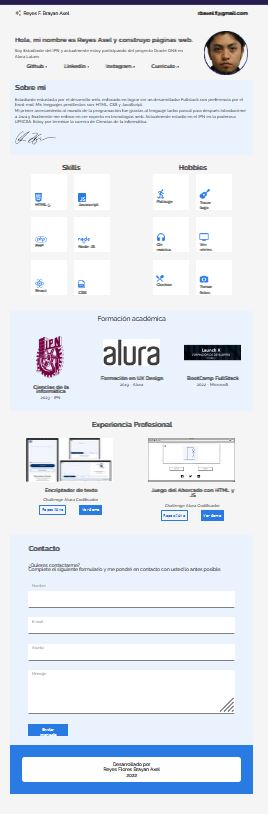

# Frontend Challenge *Curriculum vitae*

## CV

Para ingresar al CV interactivo haz click en el siguiente enlace:

[CV_Reyes_Axel](https://axlgoze.github.io/Challenge_ONE_Frontend/)

### NEXT

- elegir proyectos para seccion experiencia laboral

### To do list

- Verificar tamaño de fuente de competencias para mobil ¿1 rem es suficiente?
- integrar barras de progreso en competencias
- Hacer menu sticky
- Modificar nombre completo, completar cuando se amplie a tablet y desktop o reducir tamaño fuente
- Elegir paleta de colores
- Actualizar assets file
- Elaborar documentación con wireframe
- Elaborar copywritring
- Actualizar información
- añadir boton para convertir documento a PDF
- ~~verificar responsive design~~

- ~~implementar mobile fisrt~~
- ~~centrar img en vista mobile~~
- ~~alinear correctamente contenido de skills~~
- ~~adaptar primeras secciones (because reset.css)~~
- ~~agregar enlaces de repositorios y demos de proyectos~~
- ~~cambiar posgrado en diseño por imagen de microsoft launch x~~
- ~~Colocar imagen de juego del ahorcado en seccion experiencia~~
- agregar funcionalidad hover a inputs (investigar como hacer para cuando este activo cambie su estilo)
- ~~implementar funcionalidad JavaScript~~