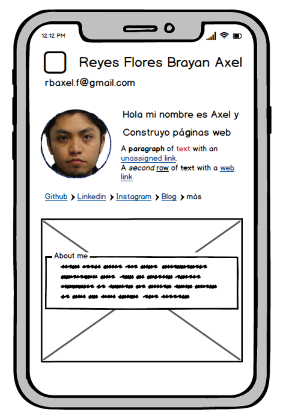

# Frontend Challenge: *Curriculum Vitae*

## UI original

## Mobile Mockup

Para ver todas las pantallas revisa el documento [PDF](./documentation/cvUpdate2023.pdf)

Para ingresar al CV interactivo haz click en el siguiente enlace:

[CV_Reyes_Axel](https://axlgoze.github.io/Challenge_ONE_Frontend/)

### To do list
- Revisar imagen de batata
- integrar barras de progreso en competencias*
- Hacer menu sticky*
- Modificar nombre completo, completar cuando se amplie a tablet y desktop o reducir tamaño fuente
- acualizar pantallas en readme file
- añadir boton para convertir documento a PDF*
- trabajar logica JS
- responsive design: ~~mobile~~ tablet, desktop
- agregar funcionalidad hover a: fichas skills y otras. inputs (investigar como hacer para cuando este activo cambie su estilo)
- agregar documentacion a gitignore

## Done

- ~~Verificar tamaño de fuente de competencias para mobil ¿1 rem es suficiente?~~
- ~~Elegir paleta de colores~~
- ~~Actualizar assets file~~
- ~~Elaborar documentación con wireframe~~
- ~~Elaborar copywritring~~
- ~~Actualizar información~~
- ~~implementar mobile fisrt~~
- ~~centrar img en vista mobile~~
- ~~alinear correctamente contenido de skills~~
- ~~adaptar primeras secciones (because reset.css)~~
- ~~agregar enlaces de repositorios y demos de proyectos~~
- ~~cambiar posgrado en diseño por imagen de microsoft launch x~~
- ~~Colocar imagen de juego del ahorcado en seccion experiencia~~
- ~~implementar funcionalidad JavaScript~~